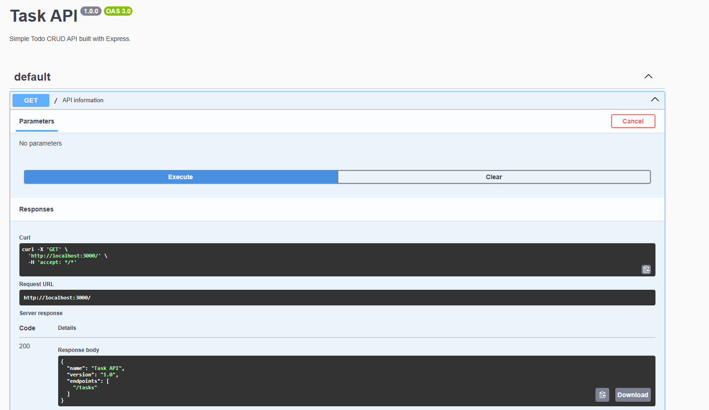
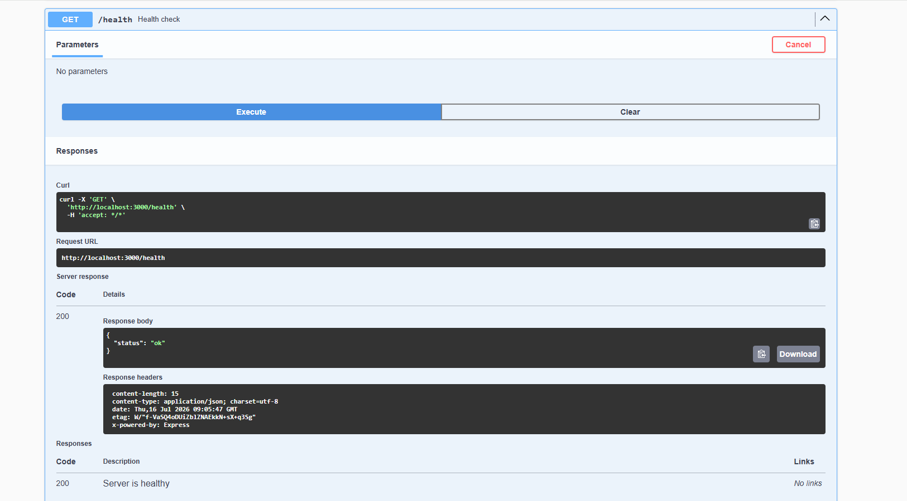
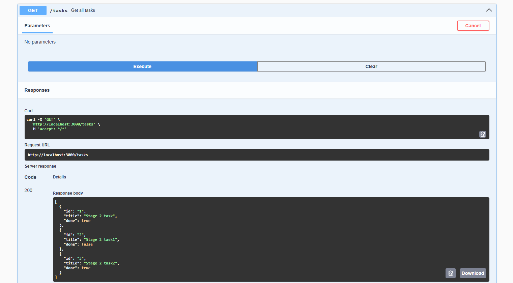
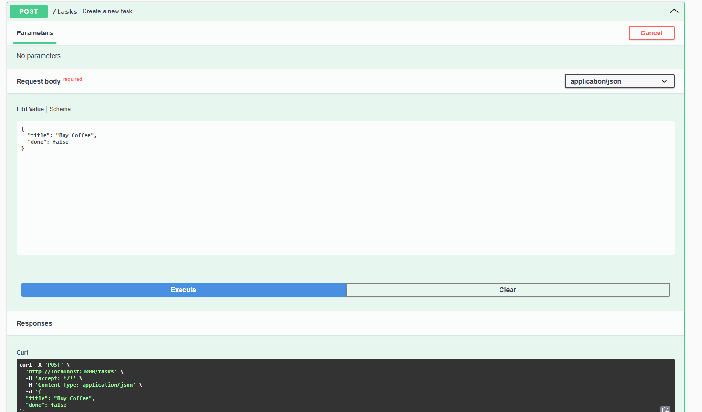
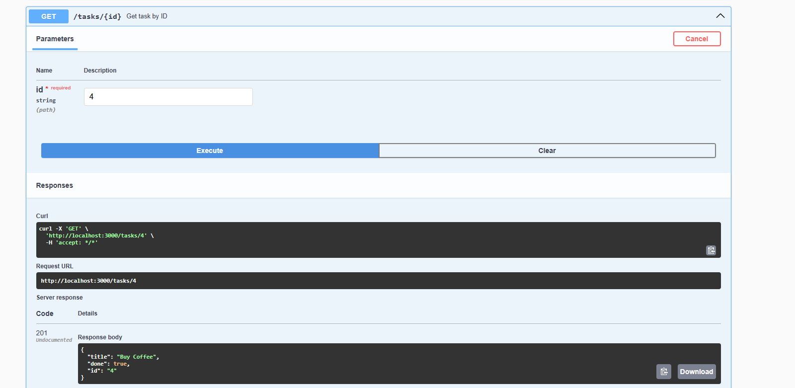
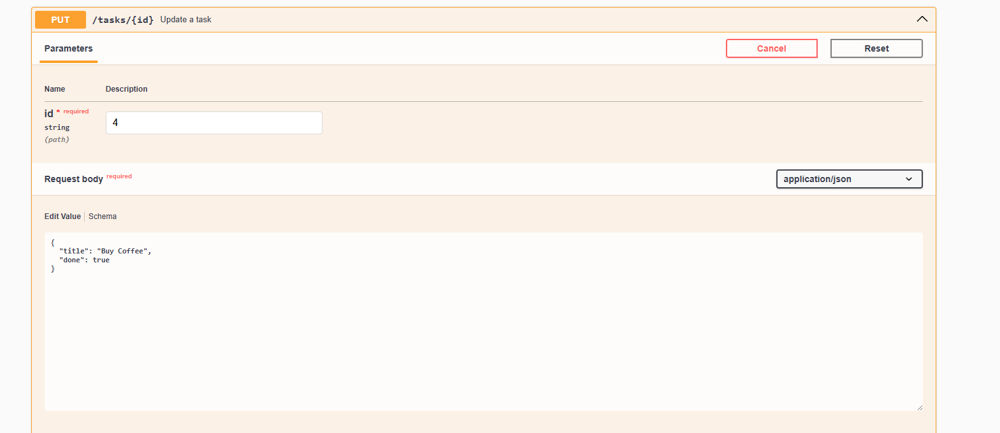
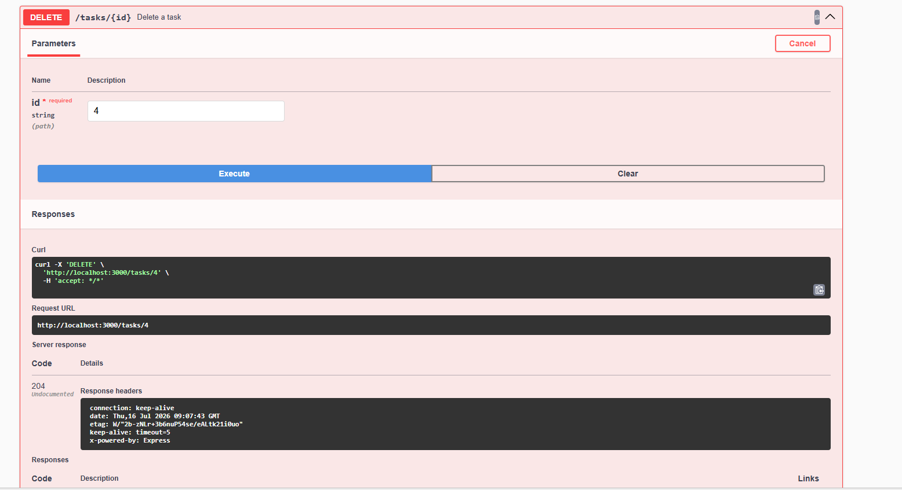

# Task API

A simple RESTful Task API built with **Node.js**, **Express.js**, and **SQLite**. The project demonstrates CRUD operations using Express and persists task data using a SQLite database initialized automatically on application startup.

---

## Features

- Get API information
- Health check endpoint
- Create a task
- Retrieve all tasks
- Retrieve a task by ID
- Update an existing task
- Delete a task
- Automatic SQLite database creation
- Automatic table creation
- Automatic seeding of sample tasks
- Interactive API documentation using Swagger UI

---

## Technologies Used

- Node.js
- Express.js
- JavaScript
- SQLite
- better-sqlite3
- Swagger UI Express
- OpenAPI 3.0

---

# Why SQLite?

SQLite was chosen because it:

- Stores all data in a single database file.
- Requires zero database server setup.
- Is lightweight and easy to use.
- Persists data between server restarts.
- Is ideal for small applications and assignments.

---

# Database

The project automatically creates the SQLite database on first startup.

Database location:

```
src/SQLITE/task.db
```

When the application starts it automatically:

- Creates `task.db` if it does not exist.
- Creates the `tasks` table.
- Inserts three sample tasks if the table is empty.

The database file is usually added to `.gitignore` so every new clone starts with a fresh database.

---

## Installation

Clone the repository

```bash
git clone https://github.com/HassaanAhmed27/FlyRankBackendAssignment1.git
```

Move into the project directory

```bash
cd Assignment1
```

Install dependencies

```bash
npm install
```

---

# Run the Project

Start the server with a single command:

```bash
npm start
```

The server runs at

```
http://localhost:3000
```

Swagger UI is available at

```
http://localhost:3000/docs
```

---

## API Endpoints

| Method | Endpoint | Description |
|---------|----------|-------------|
| GET | `/` | API information |
| GET | `/health` | Health check |
| GET | `/tasks` | Get all tasks |
| GET | `/tasks/:id` | Get task by ID |
| POST | `/tasks` | Create task |
| PUT | `/tasks/:id` | Update task |
| DELETE | `/tasks/:id` | Delete task |

---

# Example SQL Query

The following query was used during Stage 4 to verify the database contents.

```sql
SELECT * FROM tasks;
```

Example output

| id | title | done |
|----|-------|------|
| 1 | Bring Eggs | 1 |
| 2 | Bring Milk | 0 |
| 3 | Bring Bread | 0 |

---

# Database Screenshot

Add your screenshot here after opening the database in **DB Browser for SQLite**.

Example:

```
images/database.png
```

```md

```

---

## Swagger UI

### Screenshots















---

# Automatic Database Setup

A fresh clone of the project requires **no manual database setup**.

Simply run:

```bash
npm install
npm start
```

The application automatically:

- Creates `task.db`
- Creates the `tasks` table
- Inserts the three sample tasks

A new user can clone the repository and start the project in just a few minutes without any additional configuration.

---

## Author

**Hassan Ahmed**

Software Engineering Student

Sir Syed University of Engineering & Technology